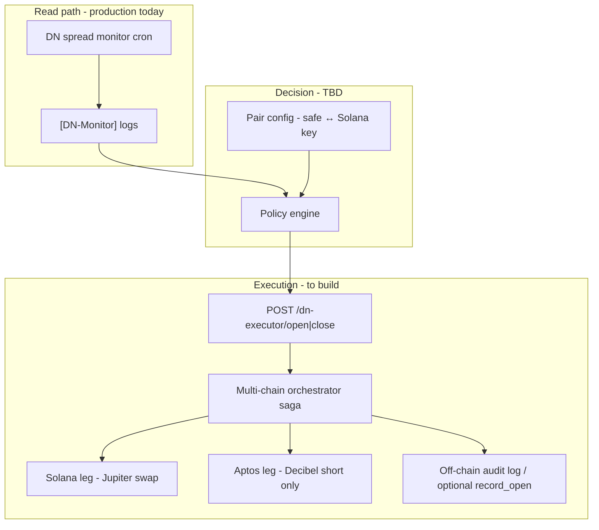

# Multi-chain delta-neutral architecture (draft)

**Status:** draft for discussion — sections marked **(TBD)** need agreement before implementation.

Living context:
- Monitor + economics: `docs/dn-spread-monitor-cron.md`, `docs/dn-spread-economics-research.md`
- Phased rollout: `docs/backlog.md` (Phase 1–4)
- Current Aptos-only executor: `executor-open-delta-neutral` (Decibel short + Hyperion spot **inside safe**)
- DN V2 bookkeeping: `docs/strategy-registry-and-dn-v2.md`

---

## Goal

Execute **Solana spot** (Jupiter) + **Aptos Decibel short** (via Yield AI safe + executor) as one logical delta-neutral position — starting with a **$200 pilot** ($100 spot / $100 short), without Yield AI Move contract changes.

---

## High-level architecture



**Separation of concerns**

| Layer | Responsibility |
|-------|----------------|
| Monitor | Quotes, spread, funding, `estimatedDaysToBreakEven` — **no txs** |
| Policy | Caps, allowlist, market rules, dry-run |
| Orchestrator | Ordering, retries, idempotency, structured audit |
| Solana executor | Jupiter quote + swap + confirm (server key) |
| Aptos executor | Decibel configure + open short + poll fill (existing patterns) |

---

## Pilot: $200, GOLD, one Solana key ↔ one Aptos safe

### Capital split (your proposal)

| Leg | Notional | Where funds sit |
|-----|----------|-----------------|
| **Spot (GOLD / XAUt)** | **$100 USDC** | Solana hot wallet (server key) |
| **Short (GOLD/USD perp)** | **$100** margin / notional | Aptos safe → Decibel subaccount |

No bridge in the hot path for pilot — **you prefund both sides manually**.

### Suggested first market

**GOLD/USD** — only monitor asset with **persistent positive** `netEntryEdgeBps` at **$500** quote sizing in recent logs. Pilot uses **~$100** spot (below $500 quote tier; executor must still fetch Jupiter quote at actual size).

**(TBD)** Minimum edge threshold at $100 size (monitor today quotes $500 / $5000 only).

---

## Open saga (pilot) — **updated after Trade #1**

**Trade #1 (2026-06-14)** used short-first by mistake; Jupiter failed on exact $100 cap. Recovery via `spotOnly`. Full ledger: `docs/dn-pilot-gold.md`.

**Recommended — Spot first (Solana → Decibel)**  
1. Preflight: Jupiter **buy** quote + Decibel mark + balances.  
2. **Solana:** Jupiter USDC → XAUt (target ~$100; fund **$101+** USDC for buffer).  
3. **Aptos:** Decibel short for **`xautOzFilled × decibelMarkPx`** notional (1× margin), poll fill.  
4. Reconcile oz / notional; alert if drift > threshold.  
5. Audit log.

**Why spot first:** Solana is the brittle leg (balance, slippage, ATA). Known spot oz before locking perp avoids short/spot notional mismatch.

**Deprecated for new opens:** short-first (kept only for `spotOnly` recovery).

**Discussion still open:** max unhedged seconds if Decibel fails after Solana buy; kill-switch / auto-unwind spot.

### Close saga (pilot)

1. Jupiter XAUt → USDC (sell quote + swap).  
2. Decibel close short.  
3. Audit log (+ optional `record_close_v2` — **TBD** semantics for Solana proceeds).

---

## On-chain bookkeeping **without contract changes**

### What the current contract expects

`delta_neutral::record_open` / `record_open_v2` is **bookkeeping only** (no fund movement). It assumes the **Aptos-only** executor flow:

| Field | Intended meaning |
|-------|------------------|
| `spot_asset_metadata` | Aptos FA metadata (e.g. WBTC on Hyperion) |
| `usdc_swapped_in` | USDC spent **from the safe** on spot swap |
| `filled_short_size` | Decibel short fill |
| `decibel_tx_version` | Decibel open tx version |
| `client_order_id_bytes` | Opaque id (0–128 UTF-8 bytes) |

Spot on **Solana** does not pass through the safe — so a literal `record_open` would **misstate** `usdc_swapped_in` and `spot_asset_metadata` if we pretend the spot leg was on Aptos.

### Pilot options (no Move changes)

| Option | On-chain | Off-chain | UI / history |
|--------|----------|-----------|--------------|
| **A — Logs only (recommended pilot)** | Nothing | Structured `[DN-Executor]` JSON: both tx sigs, sizes, quotes, P&L inputs | Manual / spreadsheet; Solana explorer + Aptos explorer |
| **B — Partial `record_open_v2`** | Executor calls `record_open_v2` with **accurate Decibel fields**; `usdc_swapped_in = 0`; encode Solana leg in `client_order_id_bytes` e.g. `sol:<tx_sig>` (≤128 bytes) | Full JSON in logs / DB | `delta-neutral-history` shows open but **spot side wrong** in UI until we add a view |
| **C — `strategy_registry` tag only** | Attach `decibel_delta_neutral` on safe | Same as A | Product badge only; no position detail |

**Recommendation for $200 test:** **Option A** (+ optional **B** if you want Decibel short visible in existing history API).

**Not recommended without contract change:** storing Solana mint as `spot_asset_metadata` — it is an Aptos address field.

### Future (post-pilot, still may be off-chain)

- Append-only **rebalance ledger** in Move (`record_rebalance_v2`) — already sketched in `strategy-registry-and-dn-v2.md` for slice adds/reduces.  
- Or dedicated **off-chain position store** (KV/Postgres) keyed by `(safe, market)` with both chain tx refs.

---

## What we need from you for the $200 test launch

### 1. Wallets and funding

| Item | Detail |
|------|--------|
| **Solana pilot wallet** | Create or designate wallet; fund **≥ $100 USDC** + **≥ 0.05 SOL** (gas buffer) on mainnet |
| **Solana private key** | Provide to server env as `DN_SOLANA_EXECUTOR_PRIVATE_KEY` (base58 or hex — **TBD** format we accept) |
| **Aptos safe** | Existing Yield AI safe address with **≥ $100 USDC** available for Decibel margin |
| **Decibel subaccount** | Linked to safe; delegation / executor permissions **already working** (same as current DN flow) |
| **Safe owner** | Address for allowlist |

### 2. Decibel / Yield AI setup (unchanged from current DN)

- [ ] `YIELD_AI_EXECUTOR_PRIVATE_KEY` on Vercel (Aptos executor — already present?)
- [ ] `DECIBEL_API_KEY`, `DECIBEL_API_BASE_URL`
- [ ] `DECIBEL_EXECUTOR_ALLOWLIST` includes safe owner
- [ ] Subaccount has granted executor + builder fee if you use builder
- [ ] **(Optional)** `decibel_delta_neutral` strategy tag on safe — for UX only

### 3. Jupiter / Solana infra

- [ ] `JUPITER_API_KEY` (quote + swap)
- [ ] Solana RPC URL (**TBD:** `SOLANA_RPC_URL` — dedicated RPC recommended for pilot)

### 4. Pair binding (config you confirm)

```json
{
  "pairId": "pilot-gold-001",
  "enabled": true,
  "aptosSafeAddress": "0x...",
  "aptosOwnerAddress": "0x...",
  "decibelSubaccountAddress": "0x...",
  "solanaExecutorPubkey": "<must match DN_SOLANA_EXECUTOR_PRIVATE_KEY>",
  "market": "GOLD/USD",
  "solanaMint": "AymATz4TCL9sWNEEV9Kvyz45CHVhDZ6kUgjTJPzLpU9P",
  "spotNotionalUsd": 100,
  "shortNotionalUsd": 100,
  "minNetEntryEdgeBps": 5,
  "maxSlippageBps": 50,
  "dryRun": true
}
```

Deliver as env `DN_PILOT_PAIR_JSON` or secure config file — **(TBD)** storage.

### 5. Operational

- [ ] `YIELD_AI_CRON_SECRET` for manual `POST` to executor routes (no public auto-trade until you opt in)
- [ ] Agree pilot window: **manual open only** (you call API) vs **semi-auto** (cron opens when monitor signals)
- [ ] Telegram / alert hook on failure mid-saga — **(TBD)**
- [ ] Confirm you accept **hot wallet risk** on Solana pilot key (limited balance)

### 6. Success criteria (pilot)

- [ ] One full **open + close** with both tx hashes logged
- [ ] Measured entry edge vs monitor prediction at $100 size
- [ ] Round-trip P&L vs spreadsheet (entry + funding + exit fees)
- [ ] Document hedge mismatch (spot qty vs short size)

---

## Implementation map (code — not started)

```
src/lib/protocols/decibel/dnMultiChain/
  pairConfig.ts
  policy.ts
  solanaJupiterExecute.ts    # sign + send (pattern: kaminoTxServer)
  aptosDecibelShortLeg.ts    # extract from executor-open-delta-neutral
  orchestratorOpen.ts
  orchestratorClose.ts
  auditLog.ts                # [DN-Executor] structured logs

POST /api/protocols/decibel/dn-executor/open
POST /api/protocols/decibel/dn-executor/close
GET  /api/protocols/decibel/dn-executor/status?pairId=
```

**Monitor extension (TBD):** quote at `$100` notional for pilot sizing.

---

## Scaling (later) — off-chain agents

| Stage | Model |
|-------|--------|
| Pilot | 1 pair, 1 Sol key, manual/semi-auto API |
| Beta | N pairs in config, **single worker**, sequential execution |
| Fleet | Job queue + workers; **one Solana key per safe** (or derived); **one Aptos executor** with nonce queue |

Vercel cron alone is insufficient (timeout, cross-chain latency 30–120s). Pattern reference: `yieldAiVaultWorker`, Hyperion LP cron caps, **s1lkpay card** execution queue (**TBD** review).

Each agent job: `{ pairId, action: open|close, signalSnapshot, idempotencyKey }`.

---

## Open discussion items

1. **Leg order** on open: **Solana spot first**, then Decibel short sized to fill (see `docs/dn-pilot-gold.md` Trade #1).  
2. **On-chain record:** logs-only vs partial `record_open_v2` with `client_order_id_bytes` carrying Solana sig.  
3. **Quote sizes:** add $100 to monitor vs ad-hoc quote only in executor.  
4. **Auto vs manual** trigger for first live $200 trade.  
5. **Failure recovery** if Solana succeeds and Aptos short fails (or reverse).  
6. **XAUt `spot_asset_metadata`** in UI — show Solana leg from off-chain audit only until contract/frontend work.  
7. **CCTP / USDC rebalance** between Solana and Aptos before fleet scale.

---

## Changelog

| Date | Notes |
|------|-------|
| 2026-06-12 | Initial draft: pilot $200 GOLD, no contract changes, bookkeeping options |
