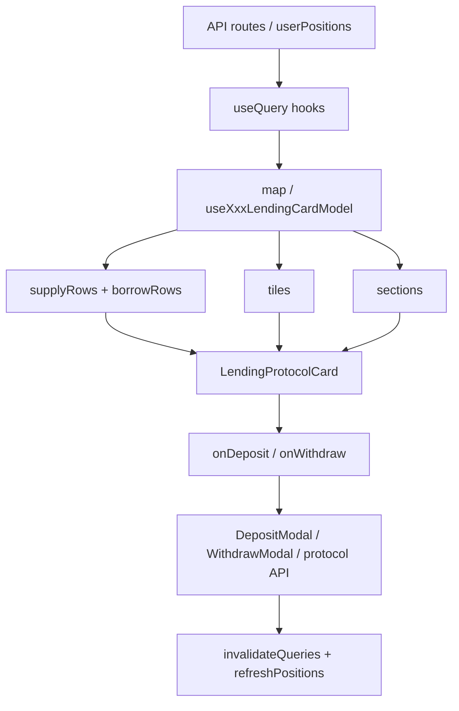

# Перевод протокола на `LendingProtocolCard` (Manage Positions)

Гайд описывает, как перевести экран **Manage Positions** с кастомной вёрстки на общий компонент `LendingProtocolCard`.

Для **сайдбара / портфеля** по-прежнему используется `ProtocolCard` — см. [`protocol-card-usequery-mini-guide.md`](./protocol-card-usequery-mini-guide.md).

---

## Два уровня UI

| Где | Компонент | Назначение |
|-----|-----------|------------|
| Sidebar, Portfolio, Mobile | `ProtocolCard` + `ProtocolCardPosition` | Сводка: список позиций, total, rewards, кнопка Manage |
| Manage Positions (модалка) | `LendingProtocolCard` | Полный lending UI: tiles, Supplies/Borrows, Deposit/Withdraw |

Один протокол обычно имеет **оба** слоя:

- `src/components/protocols/<protocol>/PositionsList.tsx` — сайдбар
- `src/components/protocols/manage-positions/protocols/<Protocol>Positions.tsx` — manage

---

## Что даёт `LendingProtocolCard`

Файлы:

- `src/shared/ProtocolCard/LendingProtocolCard/LendingProtocolCard.tsx`
- `src/shared/ProtocolCard/LendingProtocolCard/LendingProtocolCard.module.css`
- Экспорт: `src/shared/ProtocolCard/index.ts`

Возможности:

- **Tiles** — метрики сверху (Net Balance, Health Factor, Rewards, Total Assets…)
- **Sections** — `supply` и `borrow` с заголовком, meta (Balance, APR…) и таблицей строк
- **Строка** — лого, символ, цена, APR, value, amount
- **Действия** — `onDeposit` / `onWithdraw` только в секции `supply` и только если не `isCollateral`
- **Бейдж Collateral** — при `row.isCollateral === true`

---

## Контракт данных

### `LendingProtocolCardRow`

```ts
interface LendingProtocolCardRow {
  id: string;
  symbol: string;
  tokenLogoUrl?: string;
  value?: string | number;      // уже отформатировано, напр. "$1,234.56"
  amountLabel?: string;           // напр. "0.0841"
  priceLabel?: string;          // напр. "$1500.90"
  aprLabel?: string;              // напр. "1.78%" — показывать и при 0%
  isCollateral?: boolean;       // бейдж Collateral, без Deposit/Withdraw
  positionType: "supply" | "borrow";
}
```

Расширяйте тип для своего протокола (внутренние поля с `_`):

```ts
type MyLendingRow = LendingProtocolCardRow & {
  _position: MyPosition;
  _valueUsd: number;
};
```

### `LendingProtocolCardSection`

```ts
interface LendingProtocolCardSection<Row> {
  id: "supply" | "borrow";
  title: string;           // "Your Supplies (3)"
  titleShort?: string;   // "Supplies (3)" — узкий экран
  meta?: Array<{ label: string; labelShort?: string; value?: string | number }>;
  rows: Row[];
  defaultOpen?: boolean;
}
```

### `LendingProtocolCardTile`

```ts
interface LendingProtocolCardTile {
  id: string;
  title: string;
  titleShort?: string;
  icon?: "wallet" | "percent" | "health" | "gift";
  tone?: "default" | "success" | "warning" | "danger";
  value?: string | number;
  subRows?: Array<{ label: string; labelShort?: string; value?: string | number }>;
  action?: { label: string; onClick: () => void; disabled?: boolean };
}
```

---

## Пошаговая миграция

### 1. Оставить данные как есть (useQuery)

Не меняйте источник данных при переводе UI:

- `use<Protocol>Positions(address, { refetchOnMount: "always" })`
- опционально `use<Protocol>Pools`, `use<Protocol>Rewards`, borrow-хуки (Jupiter/Kamino)

После deposit/withdraw/claim:

```ts
queryClient.invalidateQueries({
  queryKey: queryKeys.protocols.<protocol>.userPositions(address),
});
window.dispatchEvent(
  new CustomEvent("refreshPositions", { detail: { protocol: "<protocolKey>" } })
);
```

### 2. Вынести маппинг в модель (рекомендуется)

**Паттерн A — отдельный хук** (как Echelon):

- `useEchelonLendingCardModel.ts` → `{ tiles, sections, supplyRows, borrowRows }`

**Паттерн B — `useMemo` внутри компонента** (как Jupiter, Kamino):

- один `useMemo` собирает `tiles` + `sections` из сырых позиций

Оба варианта ок. Для сложной логики (цены, HF, rewards) удобнее хук.

### 3. Собрать `supplyRows` и `borrowRows`

Правила:

| Тип позиции | `positionType` | Секция |
|-------------|----------------|--------|
| Supply / Earn / Lend deposit | `"supply"` | `Your Supplies` |
| Borrow / Debt | `"borrow"` | `Your Borrows` |

Форматирование делайте **до** передачи в карточку (`formatCurrency`, `formatNumber`, privacy `maskUsd` при необходимости).

**APR при 0%:** передавайте `aprLabel: "0.00%"`, не `undefined` — иначе в UI будет `—`.

```ts
aprLabel: Number.isFinite(aprPct) ? `${formatNumber(aprPct, 2)}%` : undefined,
```

### 4. Collateral (borrow-пары)

Если у протокола borrow с отдельной collateral-ногой:

1. Collateral-строки кладите в **supply** с `isCollateral: true`.
2. Debt-строки — в **borrow** с `positionType: "borrow"`.
3. Не дублируйте collateral и в supply API, и в borrow API без пометки — иначе двойной счёт в total.

**Jupiter:** `borrowCollateral` → supply + `isCollateral`, `borrowDebt` → borrow.

**Kamino Lend:** если у obligation есть borrow, все `kind: "lend"` deposit → `isCollateral: true`.

**Echelon:** отдельные supply/borrow из API, collateral через `isCollateral` на Echelon при необходимости.

### 5. Tiles (верхние плитки)

Типичный набор (как Echelon):

- Net Balance / Total Assets (`icon: "wallet"`)
- Net APY (`icon: "percent"`)
- Health Factor (`icon: "health"`, `tone` по порогам)
- Rewards (`icon: "gift"`, `action: { label: "Claim", ... }`)

Минимальный набор (Jupiter/Kamino): Total Assets + Health Factor.

### 6. Заменить кастомный список на карточку

```tsx
<LendingProtocolCard<MyLendingRow>
  headerVariant="minimal"
  tiles={tiles}
  sections={sections}
  onDeposit={(row) => { /* открыть DepositModal */ }}
  onWithdraw={(row) => { /* открыть WithdrawModal */ }}
  withdrawDisabled={isWithdrawing}
/>
```

- `headerVariant="minimal"` — в модалке Manage Positions заголовок протокола уже есть снаружи.
- Модалки deposit/withdraw оставляйте **рядом** с карточкой (как в Echelon/Jupiter).

### 7. Правила для `onDeposit` / `onWithdraw`

- Кнопки рисуются только в секции **`supply`**.
- Строки с **`isCollateral`** — без кнопок (управление на сайте протокола или отдельный flow).
- В handler проверяйте тип строки (`_position`, `_kind`, `vaultAddress`…).

### 8. Hooks: порядок вызовов

**Все** `useMemo` / `useCallback` для `tiles`/`sections` должны быть **до** любых `return` по loading/empty/error.

```tsx
// ✅ правильно
const { tiles, sections } = useMemo(() => { ... }, [deps]);

if (loading && rows.length === 0) return <div>Loading...</div>;
if (error) return <div>{error}</div>;

return (
  <>
    <LendingProtocolCard ... />
    <DepositModal ... />
  </>
);
```

Иначе React выдаст *"change in the order of Hooks"*.

### 9. Удалить дублирующую вёрстку

После миграции удалите:

- `ScrollArea` + ручные строки с `Image` / `Badge` / `Button`
- дублирующий footer «Total assets in …» (если total уже в tile)
- неиспользуемые импорты (`AccountHealthSummary` внутри списка — HF переезжает в tile)

---

## Схема потока данных



---

## Референсные реализации

| Протокол | Файл | Особенности |
|----------|------|-------------|
| **Echelon** | `manage-positions/protocols/EchelonPositions.tsx` | `useEchelonLendingCardModel`, Deposit/Withdraw modals, claim tile |
| **Jupiter** | `manage-positions/protocols/JupiterPositions.tsx` | Solana, borrow-пара supply+borrow, `isCollateral`, Jupiter modals |
| **Kamino** | `manage-positions/protocols/KaminoPositions.tsx` | Earn vault deposit/withdraw, lend collateral, rewards tooltip снизу |

Сайдбар (без LendingProtocolCard):

- `src/components/protocols/jupiter/PositionsList.tsx`
- `src/components/protocols/kamino/PositionsList.tsx`

---

## Чеклист миграции

- [ ] Данные через `useQuery`, `refetchOnMount: "always"` в Manage Positions
- [ ] `useMemo`/хук модели: `tiles`, `sections`, `supplyRows`, `borrowRows`
- [ ] Все hooks **до** early return
- [ ] `LendingProtocolCard` с `headerVariant="minimal"`
- [ ] APR: `0.00%` при нулевом APR, не прочерк
- [ ] Collateral: `isCollateral` + бейдж, без Deposit/Withdraw на строке
- [ ] Borrow-позиции только в секции `borrow`
- [ ] `onDeposit`/`onWithdraw` + существующие модалки
- [ ] `invalidateQueries` + `refreshPositions` после транзакций
- [ ] Удалена старая кастомная вёрстка списка
- [ ] Линтер без ошибок
- [ ] Сверка с сайдбаром: те же позиции и totals (с учётом net borrow)

---

## Частые ошибки

1. **Потеря позиций после миграции** — borrow collateral ушёл только в borrow или отфильтрован `borrowUsd > 0` без supply-ноги.
2. **Двойной учёт в total** — collateral и в lend supply, и в borrow summary.
3. **Hooks order** — `useMemo` после `if (loading) return`.
4. **APR `—` при 0%** — условие `apr > 0` вместо `Number.isFinite(apr)`.
5. **Кнопки на collateral** — забыли `isCollateral` или не отключили actions в карточке.

---

## Промпт для агента

```text
Переведи Manage Positions для протокола <ProtocolName> на LendingProtocolCard.
Ориентир: docs/lending-protocol-card-migration-guide.md.
Референсы: EchelonPositions (модель + modals), JupiterPositions (collateral), KaminoPositions (earn + lend).
Не трогай PositionsList для сайдбара без запроса.
Сохрани useQuery, invalidateQueries, refreshPositions.
Вынеси tiles/sections в useMemo или useXxxLendingCardModel, все hooks до early return.
Проверь collateral, APR при 0%, loading/empty states.
```

---

## Связанные документы

- [`protocol-card-usequery-mini-guide.md`](./protocol-card-usequery-mini-guide.md) — сайдбар `ProtocolCard` + query keys
- [`health-factor.md`](./health-factor.md) — расчёт HF (если применимо)
